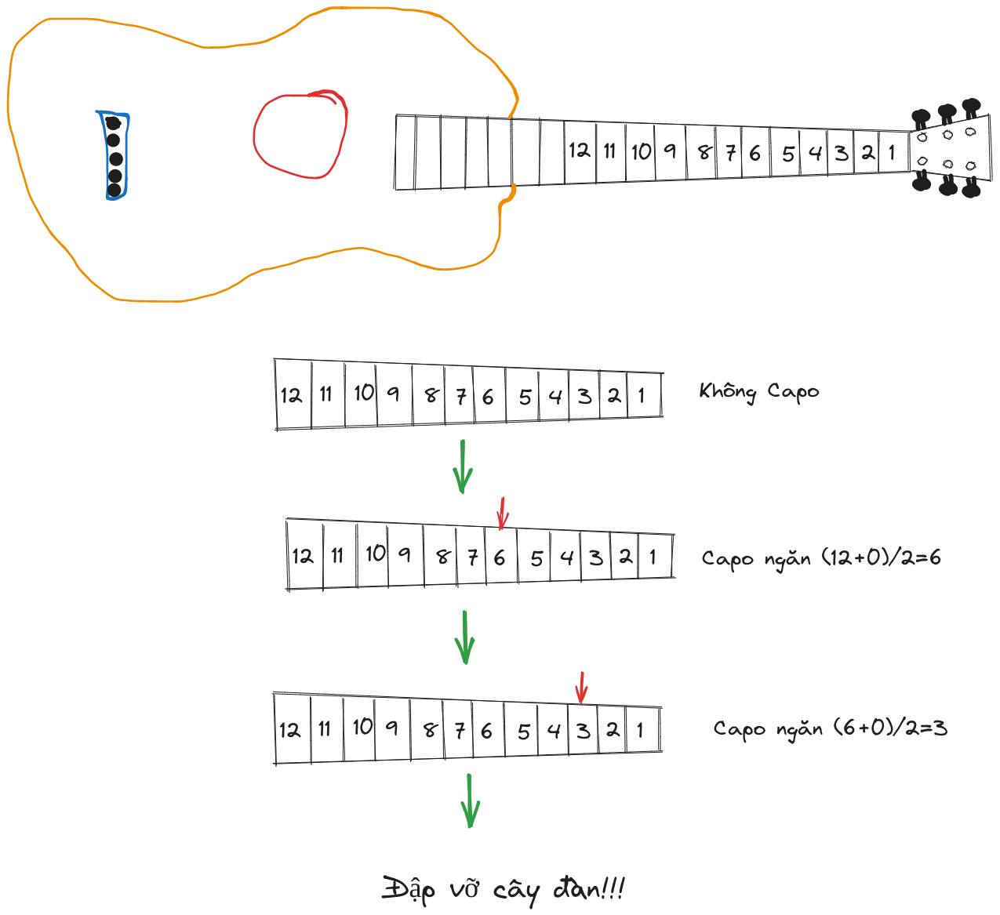

# Dò nhanh Tone Guitar với Binary Search

Giả sử bạn mở 1 bài hát và thấy hay quá , muốn lập tức đệm bài này với Tone ca sĩ. Bạn tra Google và tìm được bộ hợp âm cho bài hát nhưng không được soạn cho Tone trong bản nhạc yêu thích!

Đừng lo, bài viết này sẽ hướng dẫn cách dò nhanh Tone bạn muốn với giải thuật `Binary Search`. Mình sẽ không giải thích chi tiết về giải thuật cũng như nhạc lý.

## Trình tự thực hiện như sau:

**Bước 1:** Bật bài hát và thử chơi hợp âm, lưu ý là chỉ chơi note Bass của hợp âm đó

- Nếu thấy note này thấp hơn note ca sĩ hát thì đặt
  \\[
  \text{Ngăn Thấp Nhất = vị trí Capo hiện tại}
  \\]
  rồi đặt Capo tại
  \\[
  \frac{\text{Ngăn Cao Nhất + Ngăn Thấp Nhất}}{2}
  \\]

- Nếu thấy note này cao hơn note ca sĩ hát thì đặt
  \\[
  \text{Ngăn Cao Nhất = vị trí Capo hiện tại}
  \\]
  rồi đặt Capo tại
  \\[
  \frac{\text{Ngăn Cao Nhất + Ngăn Thấp Nhất}}{2}
  \\]

- Nếu chính là note ca sĩ hát thì bạn đã tìm đúng ngăn để đặt Capo rồi đấy!

**Bước 2:** Lặp lại Bước 1 đến khi tìm được đúng ngăn đặt Capo.

_Ví dụ:_ Ta sẽ chơi bài _Đập vỡ cây đàn_ theo [bản cover](https://www.youtube.com/watch?v=wEFtsu84NZk) và tìm được [bộ hợp âm](https://hopamchuan.com/song/4095/dap-vo-cay-dan/hoanglespaul?s=1), chơi thử sẽ thấy đây không phải tone của bản cover. Ta tiến hành dò như sau:

- Đầu tiên, đặt \\(\text{Ngăn Cao Nhất = 12}\\) và \\(\text{Ngăn Thấp Nhất = 0}\\) như hình minh họa bên dưới(cần đàn acoustic có nhiều hơn 12 ngăn nhưng hầu hết chỉ cần chơi hợp âm đến ngăn 12 thôi). Chơi note Bass của hợp âm `Am` tức là note `A` ngăn 2 dây 5
- Nhận thấy note này thấp hơn note ca sĩ hát nên đặt \\(\text{Ngăn Thấp Nhất = 0}\\) rồi đặt Capo tại ngăn \\(\frac{12+0}{2}=6\\).
- Lặp lại Bước 1, lần này chơi note D# tức là ngăn 2 dây 5 tính từ Capo.
- Nhận thấy note này cao hơn note ca sĩ hát nên ta đặt \\(\text{Ngăn Cao Nhất = 6}\\) rồi đặt Capo tại ngăn \\(\frac{6+0}{2}=3\\).
- Lặp lại Bước 1, nghe được đây chính là note mà ca sĩ hát. Quẩy thôi!

**P/s:** Do đã bỏ qua nhiều trường hợp nhạc lý, giải thuật và bạn cần một chút kiến thức về cảm âm nên bài viết chỉ là For Fun. Nếu đã đọc đến đây mà hiểu nội dung thì xin chúc mừng, bạn nằm trong số ít người làm được điều này và trong đó không có mình :v. Ít ra cũng đã có gợi ý 2 cách chơi bài hát trong Ví dụ rồi phải không nào? 🙂
