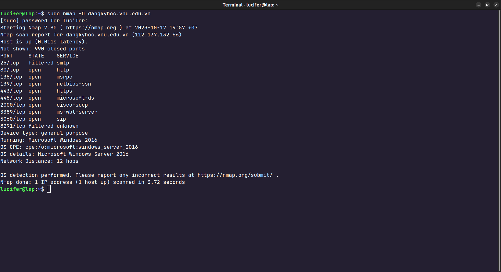
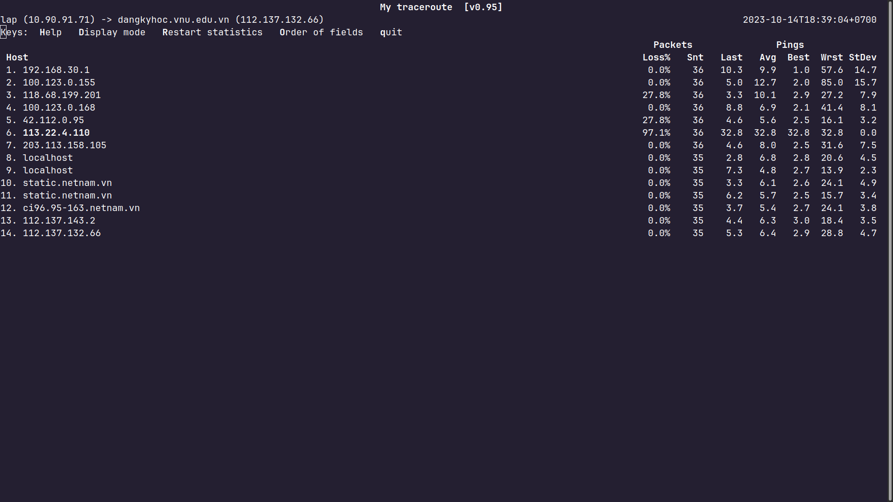
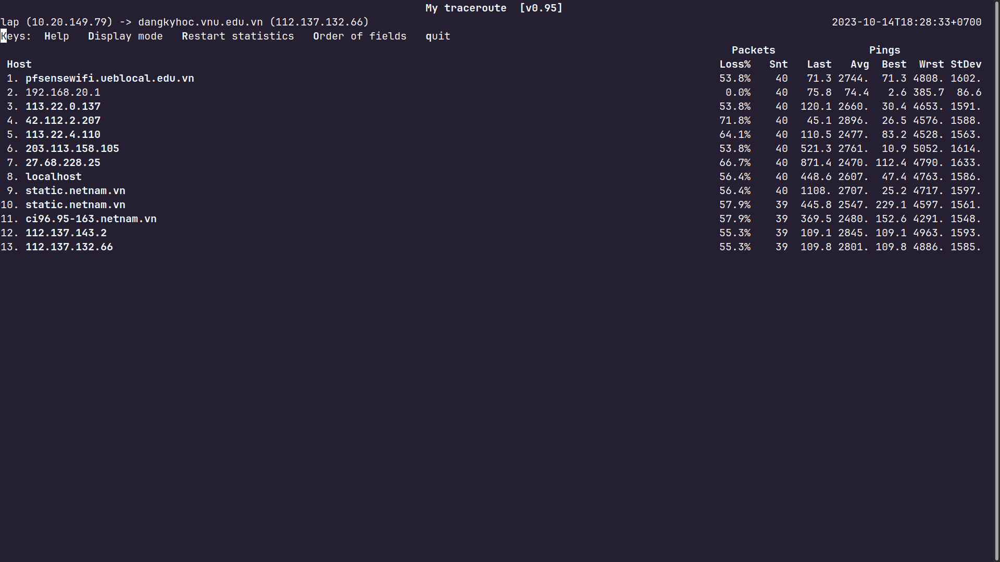
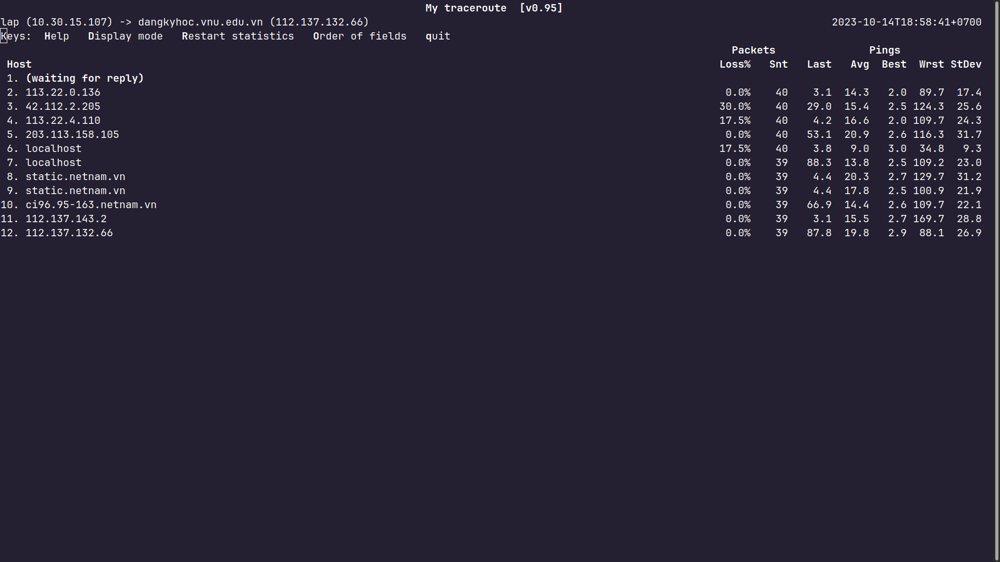
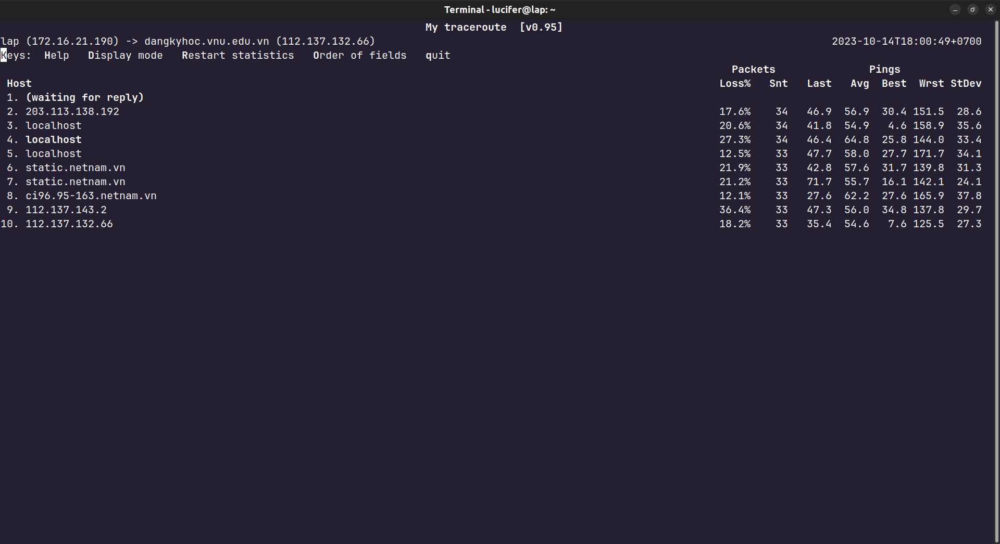
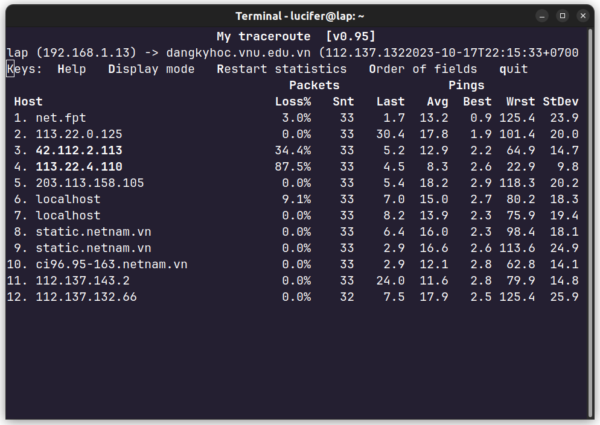
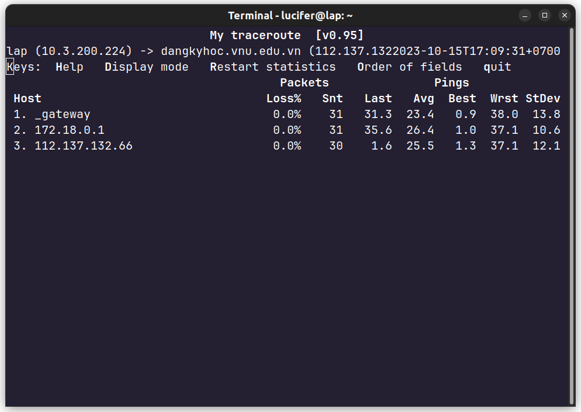
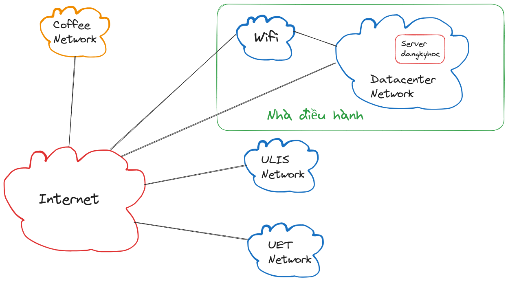
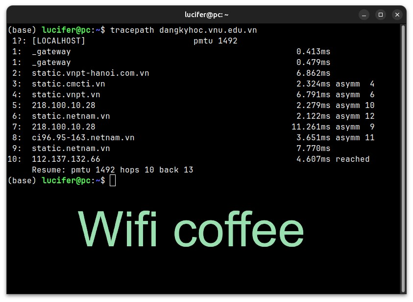
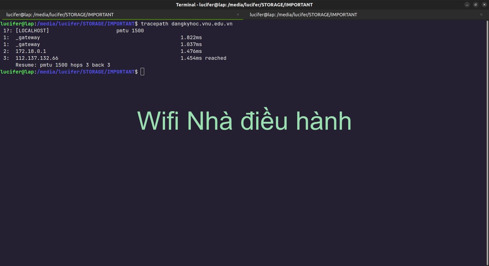

# Mẹo đăng ký học VNU

> TL;DR: Đến những nơi mạng khỏe như quán net, cafe,... để đăng ký học thực ra chưa tối ưu. Đớp môn sử dụng mạng của Nhà điều hành VNU(Xuân Thủy) hiệu quả hơn nhiều cho dù truy cập Internet có chậm hơn đi nữa.

Chi tiết kỹ thuật cho ai quan tâm được mô tả bên dưới. Tất cả thông tin đều được public cho mọi người, không có ma thuật nào đằng sau. Bạn biết điều này nghĩa là gì không? Nếu nó trông giống một con vịt, nó sẽ bơi lội và kêu quạc quạc, vì nó chỉ có vậy.

## Intro

### Nghi vấn

Sau đây là các thông tin tích lũy tạo điều kiện tiên quyết giúp hình thành các ý tưởng:

1. Siêu máy tính: Trong một Seminar năm 2019 tại VNU, một diễn giả nói rằng VNU có siêu máy tính riêng.
2. Email nội bộ: Từ 2020 trở về trước, VNU duy trì hệ thống email nội bộ. Sau đó đã [thay thế bằng dịch vụ của Google](https://vnu.edu.vn/ttsk/?C1654/N26883/Huong-dan-su-dung-he-thong-email-moi-cua-dHQGHN.htm).

#### VNU có Server riêng?

Nếu đúng thì:

- Server được đặt trong khuôn viên VNU.
- Khả năng cao trang `dangkyhoc.vnu.edu.vn` cũng được cài đặt trên Server của VNU.
- VNU có mạng nội bộ.

=> Mạng nội bộ VNU là nơi có tốc độ truy cập website Đăng ký học nhanh nhất(Do tốc độ truyền tải giữa các máy cùng mạng hầu như luôn nhanh hơn 2 máy khác mạng).

### Mục tiêu và phương án

Mục tiêu: Kiểm tra xem đăng ký học sử dụng mạng VNU có nhanh hơn mạng khác hay không.

Thứ tự thực hiện:

1. Tìm bằng chứng VNU có Server riêng
2. Đo lường thực tế

## Thực hiện

### 1. Bằng chứng

Tôi đã thu thập các bài viết, khai thác thông tin hạ tầng VNU. Kết quả như sau:

- [Bản tin tuyển dụng](https://vnu.edu.vn/home/?C2108/N29750/[CET.21.02]-Trung-tam-Khao-thi-dai-hoc-Quoc-gia-Ha-Noi-tuyen-dung-Chuyen-vien-vien-phu-trach-Ky-thuat,-ha-tang-cong-nghe-thong-tin.htm) cho thấy VNU cần người quản trị cơ sở hạ tầng công nghệ thông tin
- Sử dụng Windows Server: thông thường các nhà cung cấp dịch vụ cho thuê server sẽ sử dụng Linux, điều này củng cố giả thiết VNU có Server riêng

```shell
sudo nmap -O dangkyhoc.vnu.edu.vn
```

<center></center>

### 2. Đo lường thực tế

Giờ sẽ là lúc khảo sát thực tế truy cập website `dangkyhoc.vnu.edu.vn` tại nhiều vị trí khác nhau

```
mtr dangkyhoc.vnu.edu.vn
```

- Wifi nhà G2 UET
<center></center>

- Wifi nhà E3 UEB
<center></center>

- Wifi ULIS
<center></center>

- Wifi UL
<center></center>

- Wifi cafe
<center></center>

- Wifi Nhà điều hành VNU
<center></center>

Như vậy mạng tại Nhà điều hành là đường ngắn nhất để truy cập vào trang `dangkyhoc.vnu.edu.vn` cũng có nghĩa đây là nơi đớp môn nhanh nhất. Đáng chú ý, có vẻ mạng tại các trường thuộc VNU không được kết nối trực tiếp đến mạng của Nhà điều hành, điều này hơi khác so với suy đoán và mục tiêu ban đầu. Sơ đồ mạng VNU có thể có dạng như phác thảo bên dưới

<center></center>

## Lời kết

Tôi đã cố gắng thuật lại ngắn gọn quá trình điều tra hạ tầng mạng VNU nhằm tìm cách qua mặt các đồng môn thay vì ngồi click chuột như máy khâu và cry, rất nhiều thông tin không thật sự liên quan đã được lược bỏ. Điều thú vị là các website của các trường ULIS, UET, UL, UEB,... cũng nằm cùng mạng với Server `dangkyhoc.vnu.edu.vn`, nghĩa là mạng Nhà điều hành VNU cũng là nơi nhanh nhất để truy cập vào các trang này, dù chả hữu ích lắm. Bạn có thể hỏi tất cả những thứ này để làm gì? Chà, chỉ việc nhìn vào sự thật, điều duy nhất bạn cần nhớ là 2 hình ảnh sau:

<center></center>

<center></center>

Một khi bài viết này được public, sẽ không còn lợi thế đăng ký học nào nữa. Nhưng chả sao vì tôi tốt nghiệp rồi :). Vậy nó còn giá trị không? Câu trả lời nằm ở bạn.

> "The legendary philosopher's stone, said to have the power to turn lead into gold and grant eternal life, was not found in a far-off land or hidden deep within a treacherous cave. It was not guarded by fierce dragons or protected by ancient spells. Instead, it was found in the most ordinary of places, right next to the philosopher's own hearth. It was as if the solution to all of life's greatest mysteries had been there all along, waiting to be discovered by anyone who dared to look."

## Lưu ý về bài viết

- Mẹo trên áp dụng cho tất cả trường/khoa thuộc VNU.
- Chưa thể khẳng định Server đăng ký học nằm bên trong khuôn viên VNU.
- Nội dung có thể sai có sót do chưa có bất kỳ kinh nghiệm thực tế nào và kiến thức Computer Network chỉ ở mức cơ bản.
